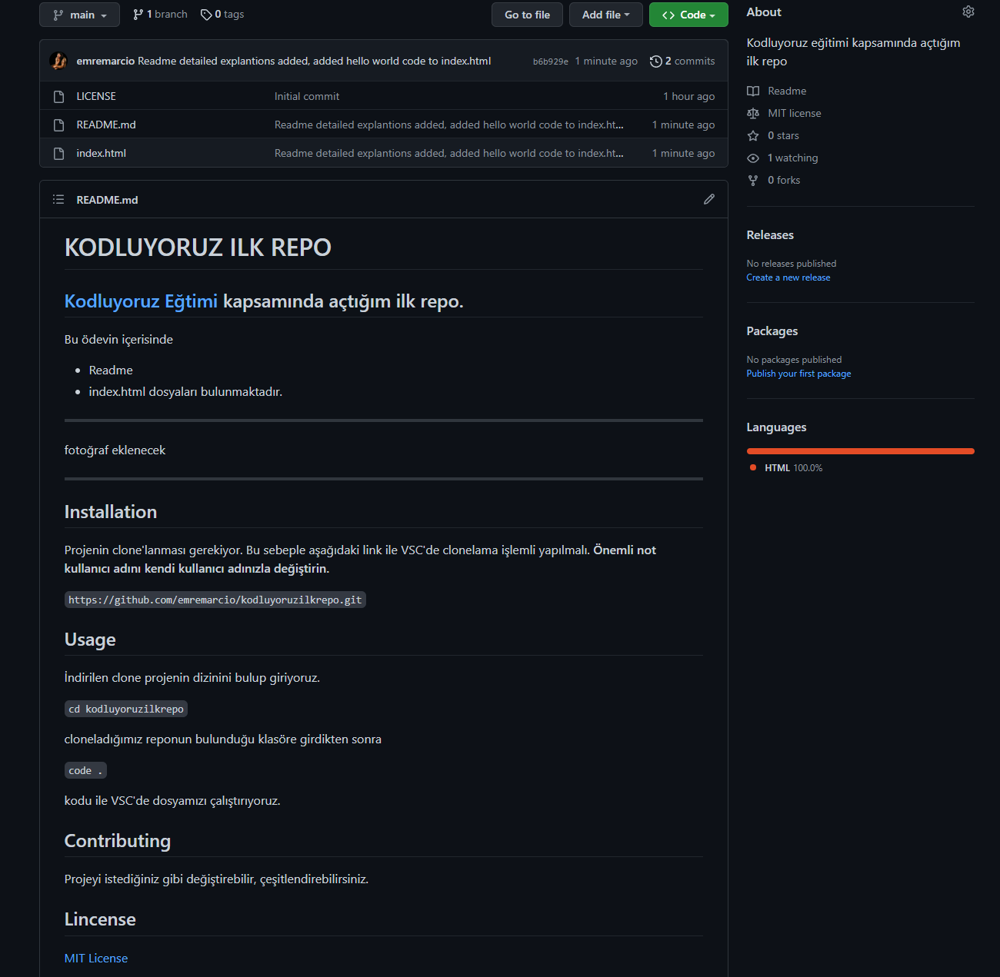

# KODLUYORUZ ILK REPO
## [Kodluyoruz](https://kodluyoruz.org) [Eğtimi](https://app.patika.dev/paths) kapsamında açtığım ilk repo.
Bu ödevin içerisinde 
- Readme
- index.html 
- img klasörü

dosyaları bulunmaktadır.

## Installation

Projenin clone'lanması gerekiyor. Bu sebeple aşağıdaki link ile VSC'de clonelama işlemli yapılmalı. **Önemli not kullanıcı adını kendi kullanıcı adınızla değiştirin.**

`https://github.com/emremarcio/kodluyoruzilkrepo.git`

## Usage
---

İndirilen clone projenin dizinini bulup giriyoruz.

`cd kodluyoruzilkrepo`

cloneladığımız reponun bulunduğu klasöre girdikten sonra

`code .`

kodu ile VSC'de dosyamızı çalıştırıyoruz.

---
## Contributing

Projeyi istediğiniz gibi değiştirebilir, çeşitlendirebilirsiniz.

---

## Lincense

[MIT License](LICENSE)